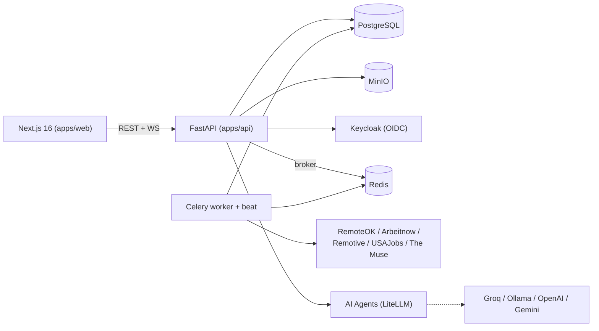

# Remote AI Platform

> AI-powered remote engineering marketplace connecting companies with remote engineers through
> transparent, explainable AI matching.

## 1. Product overview

Remote AI Platform aggregates remote engineering jobs from public job boards, builds AI-enhanced
engineer profiles from resumes, and computes explainable engineer↔job match scores. Companies get a
talent-discovery dashboard and hiring pipeline; engineers get a job marketplace, AI profile enhancement,
and a project workspace once hired.

## 2. Architecture



Full write-up: [docs/architecture.md](docs/architecture.md).

## 3. Features

- **Job marketplace** — aggregates remote engineering roles from 5 public sources (RemoteOK, Remotive,
  Arbeitnow, USAJobs, The Muse) with dedup-on-sync and search/filtering.
- **Engineer profiles** — resume upload, AI-extracted skills/experience, AI profile enhancement, public
  profile pages.
- **Company profiles & hiring** — company profile, job posting with AI job analysis, candidate ranking,
  applications pipeline.
- **AI matching engine** — multi-factor explainable match scores (skills, experience, role, timezone,
  compensation, remote fit) between engineers and jobs.
- **Networking & messaging** — connection requests and real-time chat over WebSocket.
- **Project workspace** — milestones, tasks, comments, and AI-generated project plans/progress/risk
  reports once an engineer is engaged.
- **Admin console** — platform stats and job-aggregator sync status (source, last sync, status, jobs
  imported).

## 4. Technology stack

| Layer | Technology |
|---|---|
| Frontend | Next.js 16 (App Router) + TypeScript + Tailwind CSS v4 + TanStack Query |
| Backend | FastAPI + SQLAlchemy 2 (async) + Alembic |
| Database | PostgreSQL 16 |
| Cache / Task queue | Redis 7 + Celery 5 |
| Object storage | MinIO (S3-compatible) |
| Authentication | Email/password JWT (primary) + Keycloak OIDC (provisioned) |
| AI | LiteLLM — Groq / Ollama / OpenAI / Gemini, provider-agnostic |
| Deployment targets | Vercel (frontend), Render/Fly.io (backend), Neon/Supabase (database) |

## 5. Local setup

```bash
git clone <this-repo-url>
cd remote-ai-platform
cp .env.example .env
npm install
```

Then either run everything via Docker (§6), or run the two apps directly:
```bash
cd apps/api && python3.11 -m venv .venv && source .venv/bin/activate && pip install -e ".[dev]"
uvicorn app.main:app --reload            # terminal 1 — API on :8000

cd apps/web && npm run dev                # terminal 2 — web on :3000
```
Full walkthrough, including running Postgres/Redis/MinIO/Keycloak without Docker for the backend to
connect to: [docs/development.md](docs/development.md).

## 6. Docker setup

```bash
cp .env.example .env
docker compose -f infra/docker/docker-compose.yml up -d
```

Brings up 9 services: `postgres`, `redis`, `minio` + `minio-init`, `keycloak`, `api`, `web`,
`celery-worker`, `celery-beat`. All app containers hot-reload from bind-mounted source.

| Service | URL |
|---|---|
| Web app | http://localhost:3000 |
| API docs | http://localhost:8000/docs |
| Keycloak admin | http://localhost:8080 |
| MinIO console | http://localhost:9001 |

Seed demo jobs (local/dev only — disabled when `APP_ENV=production`):
```bash
curl -X POST http://localhost:8000/api/v1/jobs/seed_demo
```

## 7. Environment variables

All variables are documented with placeholder values in [`.env.example`](.env.example) — app config,
Postgres, Redis, MinIO, Keycloak, JWT, AI/LiteLLM, job-aggregator source URLs, and feature flags.
`NEXT_PUBLIC_API_URL` is the one variable the frontend itself reads (bare API host, no `/api/v1` suffix).
The default secrets in `.env.example`/`docker-compose.yml` are development-only placeholders — always
set real high-entropy secrets for any non-local deployment.

## 8. AI configuration

All AI calls go through LiteLLM — no direct provider SDK usage in application code. Configure via
`AI_PROVIDER`, `AI_MODEL`, `AI_FALLBACK_PROVIDERS`. Details and Groq/Ollama setup:
[docs/ai-providers.md](docs/ai-providers.md).

## 9. Database migrations

```bash
cd apps/api
alembic upgrade head                              # apply
alembic revision --autogenerate -m "description"  # create a new migration
```
New domain models must be imported in `apps/api/alembic/env.py` before `--autogenerate` will see them.

## 10. Testing

```bash
cd apps/api && pytest                 # backend — in-memory SQLite, no external services needed
cd apps/web && npm run lint && npm run build   # frontend — no test suite configured yet
```
Or without a local Python interpreter, via the built dev image:
```bash
docker build -f apps/api/Dockerfile --target development -t remote-ai-api:dev apps/api
docker run --rm -v "$(pwd)/apps/api:/app" -w /app remote-ai-api:dev pytest -q
```

## 11. Deployment

Production topology (Vercel + Render/Fly.io + Neon/Supabase) and step-by-step instructions:
[docs/deployment.md](docs/deployment.md). API reference: [docs/api.md](docs/api.md).

## Documentation index

- [docs/architecture.md](docs/architecture.md) — system design, domain layout, AI pipeline
- [docs/api.md](docs/api.md) — API domains, auth model, example requests
- [docs/development.md](docs/development.md) — local dev, testing, migrations
- [docs/deployment.md](docs/deployment.md) — production deployment guide
- [docs/ai-providers.md](docs/ai-providers.md) — LiteLLM provider configuration

## License

MIT © Remote AI Platform
