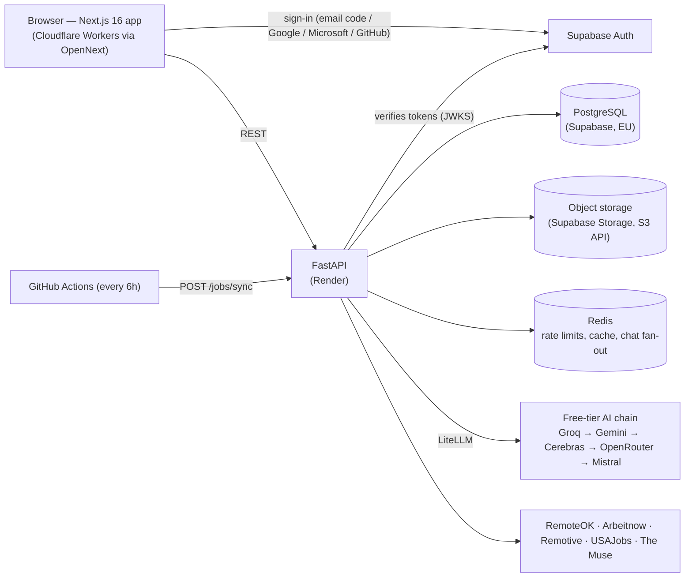

# Remote AI Platform

A remote-work marketplace for professionals and organisations: discover remote jobs, build a profile
(optionally from a resume, with AI help), apply, get matched with explainable scores, message, and run
contracted work — all on free-tier infrastructure.

Live: <https://remoteaiplatform.com> · Contact: <contact@remoteaiplatform.com>

## Architecture


```mermaid
flowchart LR
    Browser["Browser — Next.js 16 app<br/>(Cloudflare Workers via OpenNext)"] -- REST --> API["FastAPI<br/>(Render)"]
    Browser -- sign-in (email code / Google / Microsoft / GitHub) --> Auth["Supabase Auth"]
    API -- verifies tokens (JWKS) --> Auth
    API --> PG[("PostgreSQL<br/>(Supabase, EU)")]
    API --> S3[("Object storage<br/>(Supabase Storage, S3 API)")]
    API --> Redis[("Redis<br/>rate limits, cache, chat fan-out")]
    API -- LiteLLM --> LLM["Free-tier AI chain<br/>Groq → Gemini → Cerebras → OpenRouter → Mistral"]
    Cron["GitHub Actions (every 6h)"] -- POST /jobs/sync --> API
    API --> Boards["RemoteOK · Arbeitnow · Remotive · USAJobs · The Muse"]
```

- **apps/web** — Next.js 16 / React 19. The product UI is a client-rendered, hash-routed app in
  `src/figma/*` (derived from the Figma design) inside a thin Next.js shell. Resource URLs are shareable
  (`/#jobdetail/<id>`, `/#engineer/<id>`, …).
- **apps/api** — FastAPI modular monolith (`app/domains/*`: auth, engineers, companies, jobs, applications,
  matching, network/messaging, social, groups, projects, contracts, payments, trust, moderation, admin …).
  Async SQLAlchemy 2 + Alembic.
- **No background worker.** Resume parsing runs inline with a time budget; job sync is a scheduled workflow.
- **Payments are switched off** (`MARKETPLACE_PAYMENTS_ENABLED=false`): nothing is charged or held. Freelance
  work is paid directly between client and professional.

## Local development

Prerequisites: Node 22+, Python 3.11, Docker. Sign-in needs a Supabase project (use the dev project).

```bash
cp .env.example .env            # fill SUPABASE_URL / NEXT_PUBLIC_SUPABASE_* with the dev project
npm ci
docker compose -f infra/docker/docker-compose.yml up -d postgres redis minio minio-init

cd apps/api && python3.11 -m venv .venv && .venv/bin/pip install -e ".[dev]"
.venv/bin/alembic upgrade head
.venv/bin/uvicorn app.main:app --reload          # API on :8000

cd apps/web && npm run dev                        # web on :3000
```

AI features need at least one free-tier key (`GROQ_API_KEY` recommended); without one they report
"unavailable" and everything else works.

## Tests

```bash
cd apps/api && .venv/bin/pytest && .venv/bin/ruff check . && .venv/bin/mypy app
cd apps/web && npm run lint && npx tsc --noEmit && npm test
```

End-to-end journeys run against an isolated stack and a mock Supabase Auth (no real accounts or email):

```bash
python3 tests/e2e/mock-supabase/server.py &        # needs pyjwt[crypto]; ISSUER=http://host.docker.internal:9999/auth/v1
docker compose -p rap-e2e -f infra/docker/docker-compose.yml -f tests/e2e/docker-compose.e2e.yml \
  up -d --build postgres redis minio minio-init api web
cd tests/e2e && npx playwright test                # web :13000, API :18000
```

## Deployment

`prod` and `dev` branches deploy automatically after CI passes: the frontend to Cloudflare Workers, the
backend to Render via a deploy hook pinned to the tested commit. Both report the deployed commit at
`/api/version` (web) and `/health/version` (API), and the workflow waits for both to match. Migrations run
on API start. Secrets live in Infisical and the providers' dashboards — never in this repository.

More detail (architecture, operations, runbooks) is in the private companion repository.
