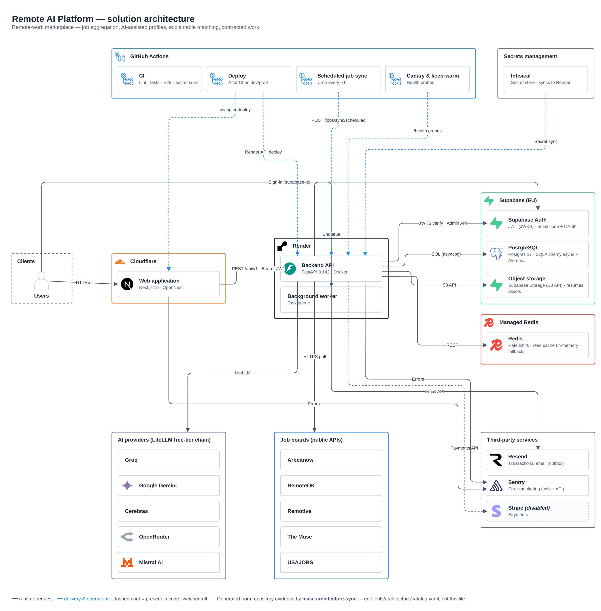
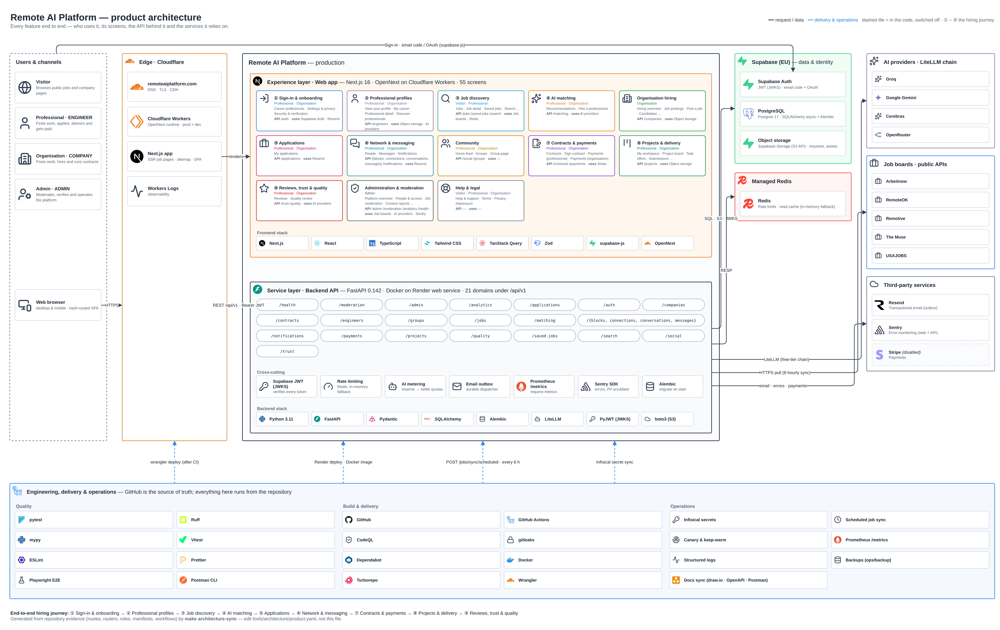

# Remote AI Platform

[](https://github.com/gokul-227/remote-ai-platform/actions/workflows/ci.yml)
[](https://github.com/gokul-227/remote-ai-platform/actions/workflows/codeql.yml)
[](https://github.com/gokul-227/remote-ai-platform/actions/workflows/production-canary.yml)


A remote-work marketplace for professionals and organisations: discover remote jobs, build a profile
(optionally from a resume, with AI help), apply, get matched with explainable scores, message, and run
contracted work — all on free-tier infrastructure.

Live: <https://remoteaiplatform.com> · Contact: <contact@remoteaiplatform.com>

## Architecture



[Open the editable draw.io diagram](docs/architecture/architecture.drawio) · machine-readable model:
[`architecture.yaml`](docs/architecture/architecture.yaml) (every component lists the files that prove it exists)

### Product architecture

Every feature end to end — who uses it, its screens, the API behind it and the services it relies on — read
from the web app's routes, the API's routers and the user roles:



[Open the editable draw.io diagram](docs/architecture/product.drawio) · model: [`product.yaml`](docs/architecture/product.yaml)

- **apps/web** — Next.js 16 / React 19. The product UI is a client-rendered, hash-routed app in
  `src/figma/*` (derived from the Figma design) inside a thin Next.js shell. Resource URLs are shareable
  (`/#jobdetail/<id>`, `/#engineer/<id>`, …). Public job pages are server-rendered at `/jobs/<id>` (title,
  canonical, Open Graph), with a sitemap and real 404s; only production is indexable.
- **apps/api** — FastAPI modular monolith (`app/domains/*`: auth, engineers, companies, jobs, applications,
  matching, network/messaging, social, groups, projects, contracts, payments, trust, moderation, admin …).
  Async SQLAlchemy 2 + Alembic.
- **No background worker.** Resume parsing runs inline with a time budget; job sync is a scheduled workflow.
  Imported jobs unseen by the sync for 30 days leave the public list. Messaging and notifications poll;
  the WebSocket endpoints stay off (`FEATURE_REALTIME_WEBSOCKETS`).
- **Secrets** live in Infisical and reach Render through an Infisical Secret Sync; never commit or paste them.
- **Backups:** `ops/backup/` (encrypted dump + storage copy, self-verifying restore).
- **Payments are switched off** (`MARKETPLACE_PAYMENTS_ENABLED=false`): nothing is charged or held. Freelance
  work is paid directly between client and professional.

## Generated documentation

The architecture diagrams and the OpenAPI document are generated from the code and checked in CI; **do not
edit them by hand**. The Postman collection is not in the repository at all: CI builds it from the code and
updates it in the Postman cloud workspace.

```text
Code / infrastructure → tools/architecture (catalog rules) → architecture.yaml → .drawio → .png
FastAPI app           → OpenAPI (docs/api/openapi.yaml)    → Postman cloud collection (via the Postman API)
```

```bash
make docs-sync      # regenerate everything (needs apps/api/.venv; the PNG needs draw.io or Docker)
make docs-check     # what CI runs: fail if anything is stale
make architecture-sync / make api-sync / make docs-test
```

**Architecture.** Source of truth: the code, infrastructure and workflows, read by `tools/architecture` with
the rules in `tools/architecture/catalog.yaml` and `product.yaml` (the only files to edit by hand).
Everything in `docs/architecture/` is generated: `*.yaml` (the machine-readable model, with evidence paths)
→ `*.drawio` → `*.png`. Generation is deterministic, so a second `make architecture-sync` changes nothing.
Evidence the rules don't recognise (a new dependency, AI provider, job board or external-service setting)
fails the sync until it is classified in `catalog.yaml`.

**CI** (`architecture-sync.yml`, `postman-sync.yml`) regenerates on every PR that touches the code. On a
same-repo PR, any update is committed to the PR branch as `docs-sync[bot]` and the checks re-run on it. A run
never commits twice in a row, so it can't loop. Fork PRs fail with the drift and the regenerated files
attached: run `make architecture-sync` (or `make api-sync`) and commit. Each workflow keeps one PR comment
up to date showing what changed. Pushes to `dev`/`prod` only check.

## Postman (cloud only)

On every push to `prod` that touches the API (and on a manual run of **Postman sync** on `prod`), CI exports
OpenAPI from the FastAPI app into a temporary file, converts it with Postman's official converter, and
updates **one** collection through the Postman API. The update replaces the collection's requests; edits
made only in Postman are overwritten. The collection stores the hash of what it was built from
(`openapi_sha256`), so an unchanged API sends nothing. Pull requests only do a dry-run conversion; they
never get the key.

Configure it under **Settings → Secrets and variables → Actions**:

| Name | Kind | Value |
| --- | --- | --- |
| `POSTMAN_API_KEY` | secret | a Postman API key whose user can edit the workspace |
| `POSTMAN_COLLECTION_ID` | variable | the collection's uid (Postman → collection → Info). Pins the target |
| `POSTMAN_WORKSPACE_ID` | variable | alternative to the above: the collection named like the API's title is found there, or created on the first run (the log prints its uid; set it as `POSTMAN_COLLECTION_ID`) |
| `POSTMAN_BASE_URL` | variable, optional | the collection's `{{baseUrl}}` (default `http://localhost:8000`) |

Without `POSTMAN_API_KEY` the job is skipped with a notice.

Locally: `make postman-sync DRY_RUN=1` converts without contacting Postman. With the variables above set in
your shell, `make postman-sync` updates the collection.

Troubleshooting: *authentication failed* → the key is wrong or expired, or its user can't edit the
workspace. *could not be read* → `POSTMAN_COLLECTION_ID` is wrong. *N collections named …* → delete the
duplicates or pin `POSTMAN_COLLECTION_ID`. *Failed to generate/convert the OpenAPI specification* → run
`make postman-sync DRY_RUN=1` locally.

## Local development

Prerequisites: Node 22+, Python 3.11, Docker. Sign-in needs a Supabase project (use the dev project).

```bash
cp .env.example .env            # fill SUPABASE_URL / NEXT_PUBLIC_SUPABASE_* with the dev project
npm ci
docker compose -f infra/docker/docker-compose.yml up -d postgres redis minio minio-init

cd apps/api && python3.11 -m venv .venv && .venv/bin/pip install -e ".[dev]"
.venv/bin/alembic upgrade head
.venv/bin/uvicorn app.main:app --reload          # API on :8000

cd apps/web && npm run dev                        # web on :3000
```

AI features need at least one free-tier key (`GROQ_API_KEY` recommended); without one they report
"unavailable" and everything else works.

## Tests

```bash
cd apps/api && .venv/bin/pytest && .venv/bin/ruff check . && .venv/bin/mypy app
cd apps/web && npm run lint && npx tsc --noEmit && npm test
```

End-to-end journeys run against an isolated stack and a mock Supabase Auth (no real accounts or email):

```bash
python3 tests/e2e/mock-supabase/server.py &        # needs pyjwt[crypto]; ISSUER=http://host.docker.internal:9999/auth/v1
docker compose -p rap-e2e -f infra/docker/docker-compose.yml -f tests/e2e/docker-compose.e2e.yml \
  up -d --build postgres redis minio minio-init api web
cd tests/e2e && npx playwright test                # web :13000, API :18000
```

## Deployment

`prod` and `dev` branches deploy automatically after CI passes: the frontend to Cloudflare Workers, the
backend to Render via a deploy hook pinned to the tested commit. Both report the deployed commit at
`/api/version` (web) and `/health/version` (API), and the workflow waits for both to match. Migrations run
on API start. Secrets live in Infisical and the providers' dashboards — never in this repository.

More detail (architecture, operations, runbooks) is in the private companion repository.

## License

Proprietary. Copyright (c) 2026 Gokul. All rights reserved. The code is publicly visible but may not be used,
copied or deployed without written permission; see [LICENSE](LICENSE). Security reports: [SECURITY.md](SECURITY.md).
