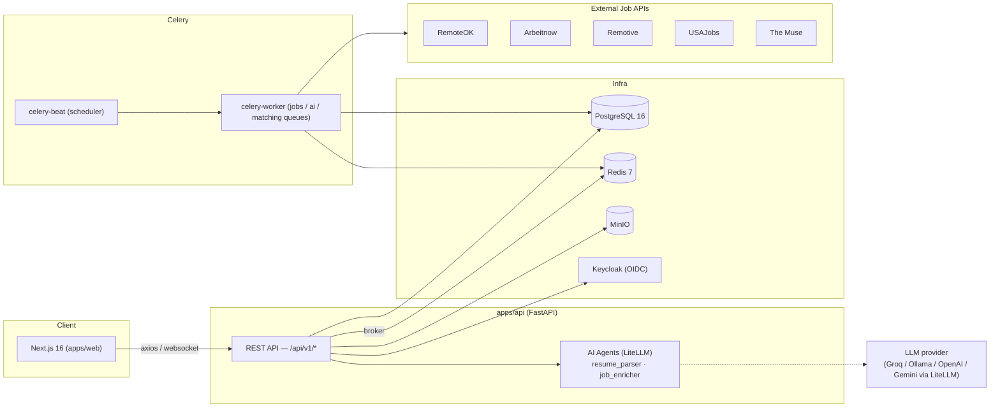

# Architecture

## Overview

Remote AI Platform is a two-app monorepo: a Next.js frontend and a FastAPI backend, backed by
PostgreSQL, Redis, MinIO, and Keycloak, with Celery handling background/scheduled work.



## Backend: domain-driven modular monolith

`apps/api/app/domains/` holds one subpackage per bounded context: `auth`, `engineers`, `companies`,
`jobs`, `matching`, `search`, `admin`, `saved_jobs`, `applications`, `projects`, `notifications`,
`network`, `marketplace` (models-only, shared by `projects`).

The five mature domains (`auth`, `engineers`, `companies`, `jobs`, `matching`) follow a consistent
layered pattern:

```
domains/<name>/
  models.py       # SQLAlchemy models
  schemas.py      # Pydantic request/response schemas
  repository.py   # DB access class (e.g. JobRepository)
  service.py      # business logic (e.g. JobService), built on the repository
  router.py       # FastAPI APIRouter — endpoints depend on a get_X_service factory
```

Newer domains (`saved_jobs`, `applications`, `projects`, `notifications`, `network`, `admin`) may only
have `models.py` + `router.py`, with logic written directly in the router. All routers are registered
in `apps/api/app/main.py` under a shared `/api/v1` prefix.

`app/core/` holds cross-cutting infrastructure, not a domain: `config.py` (env-driven `Settings`),
`database.py` (async SQLAlchemy engine + `get_db` dependency), `exceptions.py` (`PlatformException`
hierarchy + handlers), `storage.py` (MinIO helpers), `middleware.py` (request-ID logging; rate limiting
is a stub), `health.py`, `logging.py` (structlog).

## AI layer

All AI calls go through **LiteLLM** — no direct OpenAI/Anthropic/Gemini SDK imports in application code.

```
app/agents/{resume_parser,job_enricher}.py
        │
        ▼
app/services/ai/service.py (AIService)
        │
        ▼
app/agents/llm_client.py — LLMClient.complete() / complete_structured_json()
        │
        ▼
litellm.acompletion(model="<provider>/<model>", ...)
```

`LLMClient` resolves the primary model from `AI_PROVIDER`/`AI_MODEL` and falls through a list of
`AI_FALLBACK_PROVIDERS` on failure. `ResumeParserAgent` and `JobEnricherAgent` are the two concrete
agents; both request structured JSON back from the model. See [ai-providers.md](ai-providers.md) for
provider configuration.

## Job aggregation

`app/domains/jobs/aggregators/` has one adapter per external board — `remoteok.py`, `arbeitnow.py`,
`remotive.py`, `usajobs.py`, `themuse.py` — all implementing `BaseAggregator.fetch_jobs()`. `JobService.
sync_all_job_sources()` fans out across all five, **upserting** by `JobPost.external_id`
(`JobRepository.upsert_external_job`) so re-syncing never creates duplicates, and records a per-source
`ApiSyncLog` row (fetched/inserted/updated/status/duration) surfaced at `GET /admin/sync-logs` and shown
on the `/admin/dashboard` job-source status table. `celery-beat` runs the sync every 6 hours; `POST
/jobs/sync` (admin-only) triggers it manually.

## Auth model

Email/password registration and login issue self-signed JWTs (`python-jose`, HS256, `JWT_SECRET_KEY`).
Keycloak is provisioned in the stack for OIDC SSO but the primary path exercised by the frontend today
is direct email/password auth (`POST /auth/register`, `POST /auth/login`) — see `auth/service.py` and
`auth/router.py`. Roles are `ENGINEER`, `COMPANY`, `ADMIN`; `PATCH /auth/role` lets a user switch between
`ENGINEER`/`COMPANY` during onboarding but cannot self-assign `ADMIN`.

## Frontend

`apps/web/src/app/` is the Next.js App Router with plain nested folders per persona: `engineer/*`,
`company/*`, `admin/dashboard`, plus shared `auth/*`, `jobs/*`, `projects/*`, `network/*`, `messages/*`.
`src/hooks/` has one TanStack Query hook per resource. `src/lib/api.ts` is the shared axios client
(attaches the bearer token, retries once on 401 via `/auth/refresh`). Styling is a hand-rolled Tailwind
v4 "enterprise" design system in `globals.css` (`.card-enterprise`, `.btn-primary-brand`, `.badge-ent-*`),
not a component library. `RequireRole` (`src/components/RequireRole.tsx`) gates company/admin pages
client-side; the API is the real authorization boundary.

## Known scope boundaries

Some backend capabilities exist without a corresponding frontend surface yet — this is intentional MVP
scope, not a bug: AI project planning / progress / risk reports (`POST /projects/{id}/plan`,
`/ai/progress-summary`, `/ai/risk-analysis`) have no dedicated UI panel on `/projects/[id]` yet; task
status updates (`PATCH /projects/tasks/{id}`) and milestone management have backend CRUD but a read-only
frontend. Treat these as documented follow-ups, not silent gaps.
